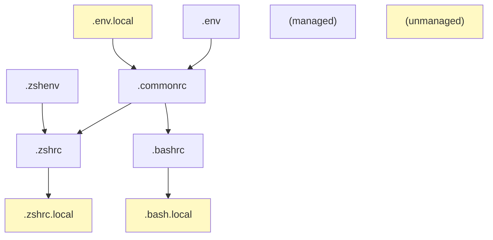

# dotfiles Managed by chezmoi

Refer: https://www.chezmoi.io/

## One-off Operations 

See <https://www.chezmoi.io/user-guide/setup/>.

```
# Install on machine with git access to my github repo
sh -c "$(curl -fsLS get.chezmoi.io/lb)" -- init --apply git@github.com:alantian/dotfiles.git

# Or for https access to my github repo
sh -c "$(curl -fsLS get.chezmoi.io/lb)" -- init --apply alantian
```

This installs chezmoi to `~/.local/bin/chezmoi` and keeps repo locally at `.~/local/share/chezmoi`.

## Daily Operations

See <https://www.chezmoi.io/user-guide/daily-operations/>.


## Structure

### Shell configs



## Reference

Reference:
  - zsh configuration files: <https://unix.stackexchange.com/questions/71253/what-should-shouldnt-go-in-zshenv-zshrc-zlogin-zprofile-zlogout>
  - bash configuration files: 
  -  <https://www.gnu.org/software/bash/manual/bash.html#Bash-Startup-Files>
  -  <https://superuser.com/questions/183870/difference-between-bashrc-and-bash-profile>


