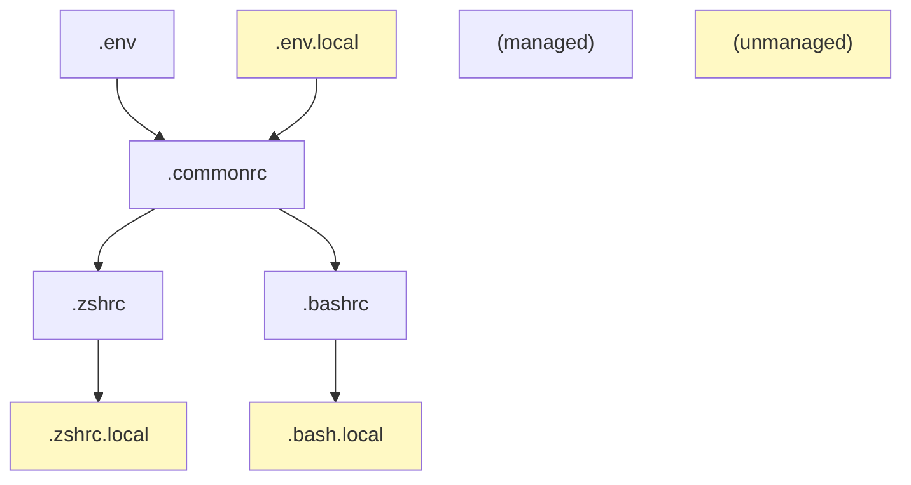

# dotfiles Managed by chezmoi

Refer:

- https://www.chezmoi.io/


## Structure

### Shell configs



### Other files
```
~/
 .vimrc        # Main vimrc
 .vimrc_local  # Machine specific vimrc, sourced by ~/.vimrc. NOT managed.
 .local/
   bin/        # Scripts, binaries, or symlinks. Expected to be in $PATH.
 opt/          # Directory for user packages.
   conda/      # An example of packages. Their files may be symlinked to ~/.local/bin
   ffmpeg/     # An example of packages that override system-wide ones.  Can be a symlink.
               # They needs to be manually added to machine-specific $PATH.
   static/     # Directory for static build.
     ffmpeg-<ver>  # An example. the ffmpeg above could be an symlink to this.

    
```


Reference:
  - zsh configuration files: <https://unix.stackexchange.com/questions/71253/what-should-shouldnt-go-in-zshenv-zshrc-zlogin-zprofile-zlogout>
  - bash configuration files: 
  -  <https://www.gnu.org/software/bash/manual/bash.html#Bash-Startup-Files>
  -  <https://superuser.com/questions/183870/difference-between-bashrc-and-bash-profile>

## Daily Operations

See <https://www.chezmoi.io/user-guide/daily-operations/>.

## One-off Operations 

See <https://www.chezmoi.io/user-guide/setup/>.

```
# Install on machine with git access to my github repo
sh -c "$(curl -fsLS get.chezmoi.io/lb)" -- init --apply git@github.com:alantian/dotfiles.git

# Or for https access to my github repo
sh -c "$(curl -fsLS get.chezmoi.io/lb)" -- init --apply alantian
```

This installs chezmoi to `~/.local/bin/chezmoi` and keeps repo locally at `.~/local/share/chezmoi`.
